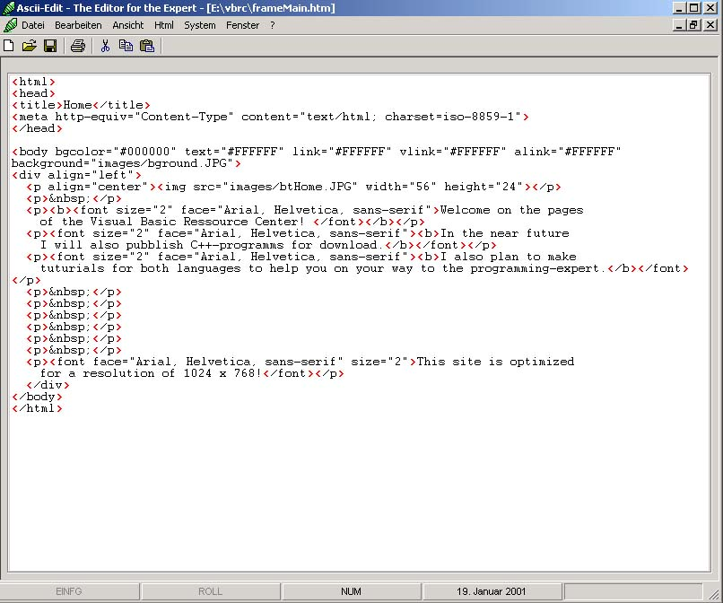



## Ascii\-Editor \(new\)

### Description

I've changed a little bit! - Try it and vote for me!
 
### More Info
 

             |
---                |---
**Submitted On**   |2001-01-19 18:42:52
**By**             |[Günther Brandner](https://github.com/Planet-Source-Code/PSCIndex/blob/master/ByAuthor/g-nther-brandner.md)
**Level**          |Intermediate
**User Rating**    |4.3 (17 globes from 4 users)
**Compatibility**  |VB 6\.0
**Category**       |[Complete Applications](https://github.com/Planet-Source-Code/PSCIndex/blob/master/ByCategory/complete-applications__1-27.md)
**World**          |[Visual Basic](https://github.com/Planet-Source-Code/PSCIndex/blob/master/ByWorld/visual-basic.md)
**Archive File**   |[CODE\_UPLOAD139201192001\.zip](https://github.com/Planet-Source-Code/g-nther-brandner-ascii-editor-new__1-14537/archive/master.zip)

